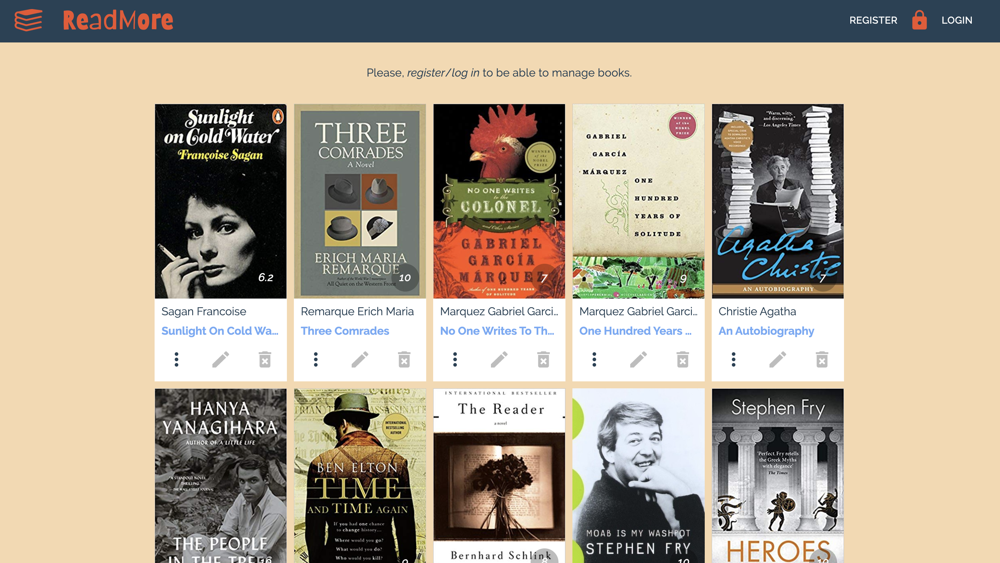
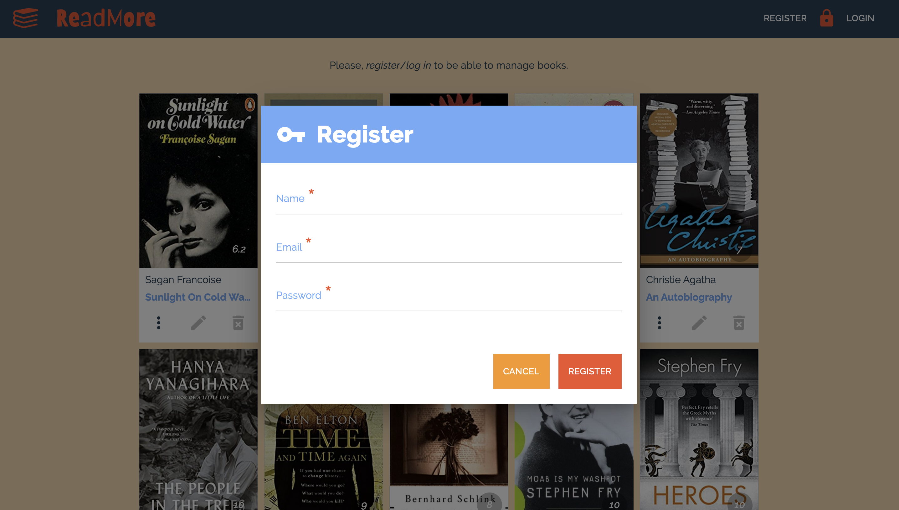
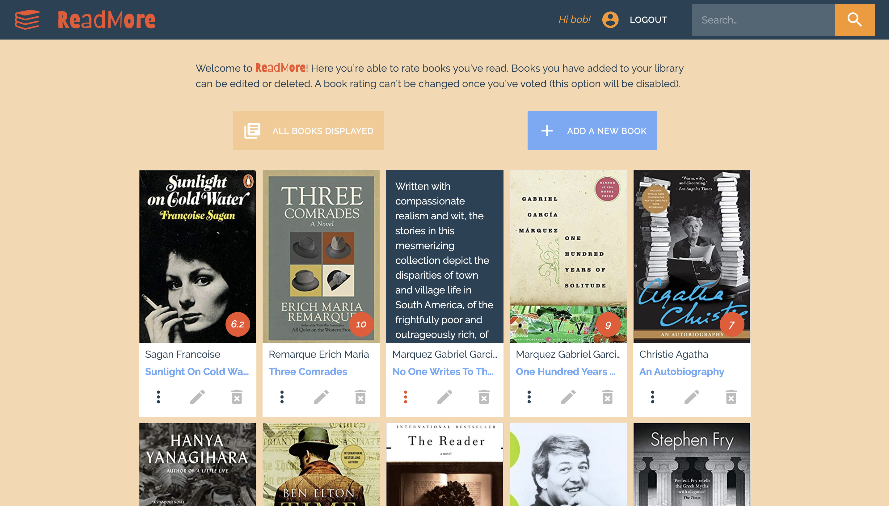
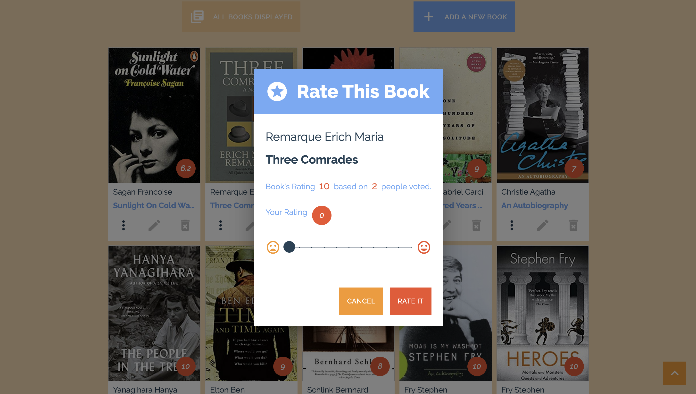
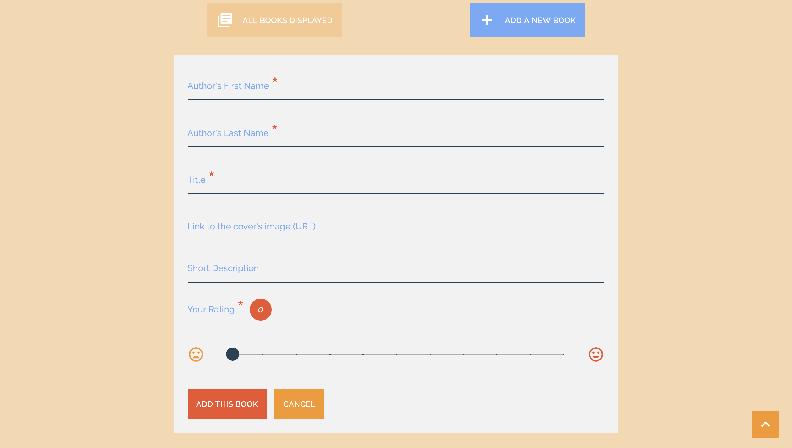
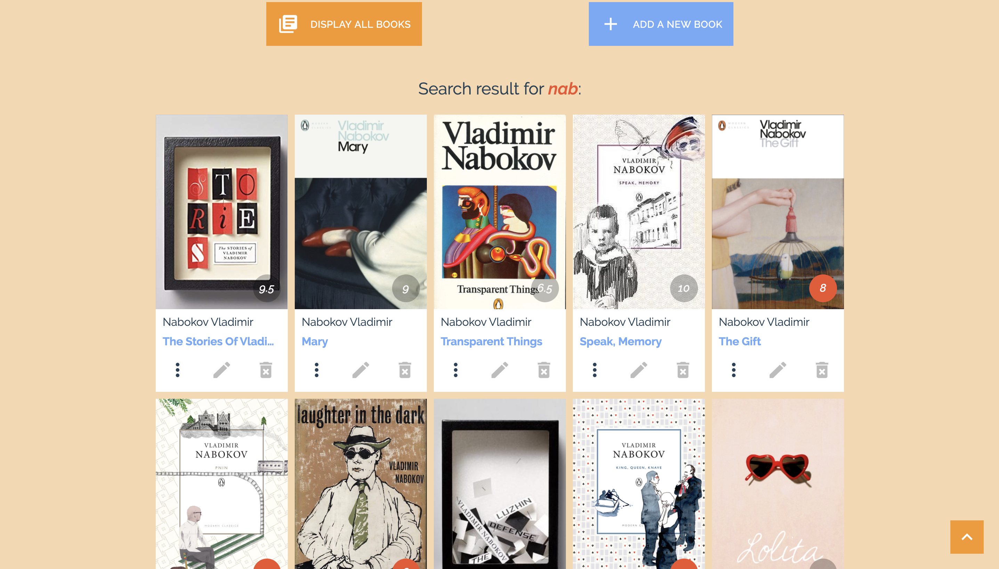
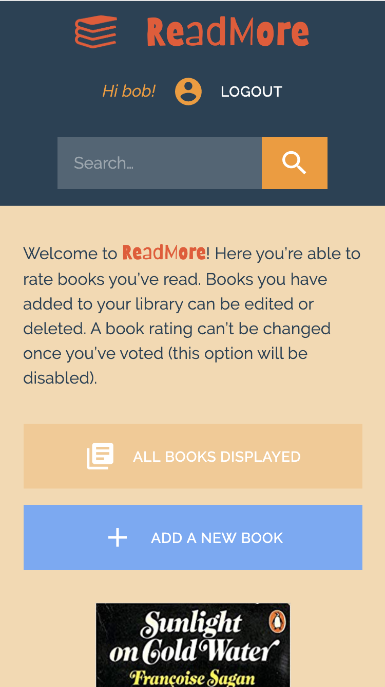

# ReadMore

ReadMore is a simple web tool where you’re able to rate books you’ve read or add some new books. 

## Live Demo

https://afternoon-reaches-61498.herokuapp.com/

## Getting Started

1. Install dependencies (using the npm install command).
2. Run the web server by using the npm run dev.
3. Connect to the server through localhost:3000.

## Dependencies

"@material-ui/core": "^4.4.3",
"@material-ui/icons": "^4.4.3",
"axios": "^0.19.0",
"es6-object-assign": "^1.1.0",
"node-sass": "^4.12.0",
"react": "^16.10.1",
"react-dom": "^16.10.1",
"react-image": "^2.2.1",
"react-redux": "^7.1.1",
"react-scripts": "3.1.2",
"react-transition-group": "^4.3.0",
"redux": "^4.0.4",
"redux-thunk": "^2.3.0",
"bcryptjs": "^2.4.3",
"concurrently": "^4.1.2",
"config": "^3.2.4",
"express": "^4.17.1",
"jsonwebtoken": "^8.5.1",
"mongodb": "^3.3.3",
"mongoose": "^5.7.6"

## Final Product

On connection you will receive a list of books: 

You need to register or log in to be able to rate exicting books or add some new books:

Now you’re able to rate books you’ve read. Books you have added to your library can be edited or deleted. A book rating can’t be changed once you’ve voted (this option will be disabled):

You can search books by typing a part of author's last name or title:

This app is responsive (mobile version):

